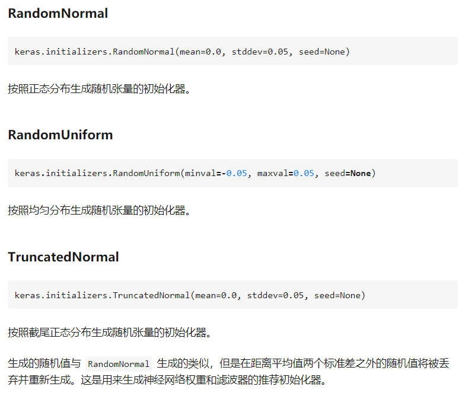

## 1. Activate Function
[传送门](https://zhuanlan.zhihu.com/p/61669205)
从定义来讲，只要连续可导的函数都可以作为激活函数，但目前常见的多是分段线性和具有指数形状的非线性函数。
神经网络中激活函数的主要作用是提供网络的**非线性建模能力**，如不特别说明，激活函数一般而言是非线性函数。假设一个示例神经网络中仅包含线性卷积和全连接运算，那么该网络仅能够表达线性映射，即便增加网络的深度也依旧还是线性映射，难以有效建模实际环境中非线性分布的数据。加入（非线性）激活函数之后，深度神经网络才具备了分层的非线性映射学习能力。

### 1.1 Sigmoid/logistic函数
$$f(x)=\frac{1}{1+e^{-x}}$$

特点： 
- 输出范围0-1，很符合人的主观意识，即神经元对感知的也是从不激活(0)到完全激活(1)。 
- 单调连续 
- 容易求导，导数为$f(x)(1-f(x))$，用自己就可以表示自己的导数。

缺点：
- 具有软饱和性（左软饱和性指x趋近于负无穷，导数趋近于0，右饱和性指x趋近于正无穷，导数趋近于0），在输出值较大较小时，网络很难更新，因为BP算法是更具梯度来进行的，这也是所谓的梯度消失问题。
- 输出不是以0为中心，而是0.5。但是相对于前一条缺陷，影响没那么大。

### 1.2 Tanh函数
$$tanh = \frac{e^x-e^{-x}}{e^x+e^{-x}}$$

特点： 
- 收敛速度比sigmoid函数快，原因是：tanh 的输出均值比 sigmoid 更接近 0，SGD会更接近natural gradient（一种二次优化技术），从而降低所需的迭代次数。
缺点：
- 依然存在软饱和性。

### 1.3 Relu函数
$$f(x)=
\begin{cases}
0, x < 0 \\
x, x \geq 0
\end{cases}$$

当时AlexNet提出的激活函数，非常优秀，很长一段时间是我们设计CNN网络的默认激活函数。
特点： 
- 当输入为正数时，输出导数恒为1，缓解了梯度消失的问题。 
- 为网络带来稀疏性，当输入值小于0，就会被稀疏掉，人的大脑稀疏性高达95%。 
- 不管是正向计算，还是导数计算都非常简单。

缺点：
- 左硬饱和性，当输入小于零时，导数恒为0，会使很多神经元无法得到更新，出现“神经元死亡”。 
- relu函数输出无负值。 
- 均值漂移，relu函数的输出均值恒大于0（从relu函数的输出范围就能看出来）

**Leaky ReLU**
$$f(x)=max(\alpha *x,x)$$
特点： 
- 为了解决relu中“神经元死亡”的问题，leaky relu给小于零的输入一个非常小的梯度。

缺点： 
- 公式中的 $\alpha$ 是一个很小的值，一般取0.01，首先这就是个超参数，另外也有文献指出它的性能很不稳定，有时候比relu好，有时候差，可想而知，不太靠谱。

**PReLU**
$$f(x)=max(\alpha *x,x), \alpha通过学习得到$$
特点： 
- 收敛速度比relu快。 
- 输出均值更接近0。

缺点： 
- 目前还不清楚，只能说表现还不稳定，不够“通用”，其作者何凯明在他的ResNet也没使用，而是使用的ReLU。

**RReLU**
和PReLU类似，只不过它这里的 $\alpha$ 参数是一个高斯分布上的随机值，在测试时固定

**ELU**
$$f(x)=
\begin{cases}
\alpha (e^x-1), x \leq 0 \\
x, x > 0
\end{cases}$$
$$f^{'}(x)=
\begin{cases}
f(x) +  \alpha, x \leq 0 \\
1, x >0
\end{cases}$$

特点： 
- 较高的噪声鲁棒性。 
- 输出均值在0附近。

缺点：
- 存在指数运算，运算量较大。

**SELU**
$$f(x)=\lambda * ELU$$

特点： 
- 新增的参数 $\lambda$ 大于1，所以在正半轴，函数的导数是大于1的。 
- 激活函数有一个不动点，网络深了以后每一层的输出都会向正态分布靠拢，美其名曰自归一化。

缺点： 
- selu的证明部分前提是权重服从正态分布，但是这个假设在实际中并不能一定成立，比如钟形分布？（不太懂）
- 众多实验发现效果并不比relu好。

**CReLU**
$f(x)=[ReLU(x),ReLU(-x)]$
特点： 
- 输出通道数翻倍，相当于利用对称的关系，将负相位的信息人为恢复出来。

缺点： 
- 到底在哪些层使用，太依赖调试了。

### 1.4 Maxout
$$max(w_1^Tx+b_1, w_2^Tx+b_2,...,w_n^Tx+b_n)$$
特点： 
- maxout可以拟合任意的凸函数。 
- 具备relu的所有优点。 
- 不会出现神经元死亡。

缺点： 
- （不错的解释）参数量巨大（以k倍增加），因为之前我们每个神经元只需要一组权重和偏置，现在不是了，我们添加了冗余的k组权重和偏置，让输入均经过这些权重和偏置计算，只保留激活值最大的输出。

### 1.5 Swish
$$f(x)=x*sigmoid(\beta * x)$$
其中 $\beta$ 参数可以是常数也可以是训练的。

特点： 
- 无上界有下界、平滑、非单调。 
- Swish函数可以看做是介于线性函数与ReLU函数之间的平滑函数。 
- 论文给出的实验，各种数据集上，各种网络，都比relu性能好（并且在深层网络上优势更大）。

缺点： 
- 只有实验证明，没有理论支持。 
- 在浅层网络上，性能与relu差别不大。

### 1.6 Binary
$$f(x)=
\begin{cases}
0, if x < 0 \\
1, if x \geq 0
\end{cases}$$
缺点：
- 导数恒为0，不适合现代神经网络

### 1.7 softmax
[传送门](https://zhuanlan.zhihu.com/p/25723112)
$$f(x_i)=\frac{e^{x_i}}{\sum_{j=1}^{N}e^{x_j}}$$

输出为$(0,1)$, 梯度反向传播简单

## 2. Back-Propagation

传送门： 《神经网络与机器学习》， chapter 4-5
<!-- 给定样本$(\pmb{x},\pmb{y})$，将其输入到神经网络模型中，得到网络输出为$\hat{\pmb{y}}$，假设损失为$\mathcal{L}(\pmb{y},\hat{\pmb{y}})$，计算第$l$层的参数$\pmb{W}^{(l)}$和$\pmb{b}^{l}$的偏导数。根据链式法则：
$$\frac{\partial \mathcal{L}(\pmb{y},\hat{\pmb{y}})} {\partial w_{ij}^{(l)}} = \frac{\partial \pmb{z}^{(l)}} {\partial w_{ij}^{(l)}} \frac{\partial \mathcal{L}(\pmb{y},\hat{\pmb{y}})} {\partial \pmb{z}^{(l)}}$$

$$\frac{\partial \mathcal{L}(\pmb{y},\hat{\pmb{y}})} {\partial \pmb{b}^{(l)}} = \frac{\partial \pmb{z}^{(l)}} {\partial \pmb{b}^{(l)}} \frac{\partial \mathcal{L}(\pmb{y},\hat{\pmb{y}})} {\partial \pmb{z}^{(l)}}$$
1. $\frac{\partial \pmb{z}^{(l)}} {\partial w_{ij}^{(l)}}$，因为$\pmb{z}^{(l)} = \pmb{W}^{(l)}\pmb{a}^{(l-1)}+\pmb{b}^{(l)}$，于是偏导数：

$$\frac{\partial \pmb{z}^{(l)}} {\partial w_{ij}^{(l)}} = []$$ -->

**梯度消失**

## 3.优化策略

### 3.1 Gradient Descent(梯度下降)
[传送门](https://zhuanlan.zhihu.com/p/64402931) [传送门](https://www.cnblogs.com/pinard/p/5970503.html)

$$\theta ^{'} = \theta - \alpha \frac{\partial \mathcal{L}}{\partial \theta}$$
$\alpha$：学习率， $\theta$：参数， $\frac{\partial \mathcal{L}}{\partial \theta}$，梯度

#### 3.1.1 Batch Gradient Descent, BGD(批量梯度下降法)

批量梯度下降法，是梯度下降法最常用的形式，具体做法也就是在更新参数时使用所有的样本来进行更新.
$$\theta := \theta + \alpha \sum_{i=1}^{m}(y^{i}-h_{\theta}(x^{(i)}))x_j^{(i)}$$
对所有样本计算梯度之和，然后再更新参数

#### 3.1.2 Stochastic Gradient Descent, SGD(随机梯度下降)

for i in range(m):
$$\theta := \theta + \alpha (y^{i}-h_{\theta}(x^{(i)}))x_j^{(i)}$$
先对每个样本计算梯度，然后更新参数，以此循环。这样速度会非常快，但是梯度更新的方向随机性大，可能不会很快收敛，甚至无法收敛到局部最优解

#### 3.1.3 MBGD（Mini-Batch Gradient Descent）
将BGD和SGD求一个折中的办法，每次从数据集中选取一小部分的数据进行计算梯度，这样既能加快梯度下降的迭代速度又可以降低数据集中单一噪音数据点对优化的影响。

### 3.2 Momentum Optimizer
Momentum Optimizer即动量优化法。GD一般具有恒定的learning rate，而且每次只利用当前梯度的信息，这样可能会存在收敛速度非常慢，甚至无法收敛的情况。Momentum引入了一个momentum vector，每次参数的更新不仅与本次计算的梯度相关，还与之前的梯度相关，这样参数更新的方向会朝向更加有利于收敛的方向，收敛速度更快

$$m = \beta m + \eta \bigtriangledown_\theta J(\theta) $$
$$\theta := \theta - m$$
### 3.3 Nesterov Accelarated Gradient（NAG）
Nesterov Accelarated Gradient简称NAG，是在Momentum的基础上改进得到的一个算法，不同之处在于m每次更新时加上梯度的不同，Momentum是加上当前位置$\theta$的梯度，而NAG是加上当前位置之后一点点$\theta + \beta m$处的梯度。这样做会使动量m指向更加正确的（局部）最优点的方向，加快收敛到极值点。NAG的参数更新公式如下：
$$m:=\beta m + \eta \bigtriangledown_\theta J(\theta + \beta m) $$
$$\theta := \theta - m$$

### 3.4 AdaGrad Optimizer
AdaGrad Optimizer即自适应梯度下降法，其参数更新公式如下：
$$s := s + \bigtriangledown_\theta J(\theta) \otimes \bigtriangledown_\theta J(\theta)$$
$$ \theta := \theta - \eta \bigtriangledown_\theta J(\theta) / \sqrt{s + \epsilon}$$

AdaGrad本质上就是对每次更新的各维梯度做了一个自适应缩放操作.这个缩放操作是通过除以$\sqrt{s + \epsilon}$来完成的。$s$一直在累加各维梯度之和（会越来越大），$\epsilon$是平滑因子，作用是防止分母为0，一般会取非常小的值（如$10^{-9}$）。这样一来，随着迭代的增加，参数的的更新速度会越来越慢，这样可以减小震荡，避免因步长太大而无法收敛到极值点。它的缺点是在进行复杂函数（Deep Learning）优化的时候，容易过早收敛，这样就无法收敛到全局极小值，而是收敛到局部极小值点

### 3.5 RMSProp Optimizer

AdaGrad的主要问题在于它的梯度减小速度太快了，以至于很快陷入局部极值点。RMSProp通过只累加最近一次的梯度来解决这个问题。其参数更新公式如下：

$$s = \beta s + (1-\beta) \bigtriangledown_\theta J(\theta) \otimes \bigtriangledown_\theta J(\theta)$$
$$ \theta := \theta - \eta \bigtriangledown_\theta J(\theta) / \sqrt{s + \epsilon}$$

式中，超参数$\beta$为衰减因子（decay rate），表示之前的梯度累和对于当前的影响大小，这个大小是按照指数速率衰减的，离当前越远的梯度对当前的影响越小（因为指数衰减）

### 3.6 Adam Optimizer

Adam的全称为adaptive momentum estimation，它结合了Momentum和RMSProp的思想。和Momentum一样，记录之前梯度的指数平均；和RMSProp一样，记录之前梯度平方和的指数平均。其参数更新公式如下：
$$m := \beta_1 m + (1- \beta _1) \bigtriangledown_\theta J(\theta)$$
$$s:=\beta_2s + (1-\beta_2)\bigtriangledown_\theta J(\theta) \otimes \bigtriangledown_\theta J(\theta)$$
$$m:=\frac{m}{1-\beta_1}$$
$$s:=\frac{s}{1-\beta_2}$$
$$\theta = \theta - \eta m /\sqrt{s + \epsilon} $$

第一个式子和Momentum的形式类似；第二个式子和RMSProp的形式类似；第五个式子相比于RMSProp将当前的梯度换成了当前的动量$m$，这就相当于Momentum和RMSProp的结合；考虑到$m%和$s$初始时为0，第三个式子和第四个式子的作用是在初始时给到$m%和$s$加速。到$\beta_1$和$\beta_2$为超参数，一般将$\beta_1$设为0.9，将$\beta_2$设为0.999，平滑系数$\epsilon$设为$10^{-8}$，Adam是一个自适应的优化算法，所以也不需要手动对学习率进行调整。综合来看，Adam集成了其他算法的优点，是这几种优化算法里面最优的一个

## 4. 权值初始化

**由于梯度反向传播算法，梯度反向传播受梯度值和激活函数导数的影响，若大于1，则会发生梯度爆炸，若小于1，则会发生梯度消失**

$$\delta^{l} = f_{l}^{'}(\pmb{z}(l))(\pmb{W}^{(l+1)})^T]\delta^{(l+1)}$$

### 4.1 初始化为全等常数

每层所有神经元相等，效果等价于一个神经元，这无疑极大限制了网络的能力。
特别地，全0初始化，根据式（3），反向传播时所有的梯度为0，权重不会更新，一直保持为0。

**什么样的初始化是好的？**
- 因为对参数 $w$ 的大小和正负缺乏先验知识，$w$ 应为为随机数，且期望 $E(w)=0$；
- 在限定期望$E(w)=0$后，为了防止梯度消失和梯度爆炸，参见公式（3），权重不易过大或过小，所以要对权重的方差$Var(w)$有所控制；
- 不同激活层输入的方差相同，即 $Var(z^{l})=Var(z^{(l+1)})$ ;
权重初始化时，权重的数值范围（方差）应考虑到前向和后向两个过程。数值太大，前向时可能陷入饱和区，反向时可能梯度爆炸；数值太小，反向时可能梯度消失。

### 4.2 Xavier

**核心思想：正向传播时，激活值的方差保持不变；反向传播时，关于状态值的梯度的方差保持不变。**

### 4.3 He初始化

**核心思想：正向传播时，状态值的方差保持不变；反向传播时，关于激活值的梯度的方差保持不变。**
Xavier假定激活函数在0附近为线性函数，这对于Relu是不成立的。he初始化是针对Relu激活函数的初始化方法。

### 4.4 其他

## 5. 梯度爆炸、消失原因及解决方案

[传送门](https://zhuanlan.zhihu.com/p/33006526)
原因:一是在深层网络中，二是采用了不合适的损失函数，比如sigmoid。梯度爆炸一般出现在深层网络和权值初始化值太大的情况下(**深度网络中，参数或者激活函数选用不当，导致反向传播时网络学习率太大或者太小**)

解决方案：
#### 5.1 预训练加微调
此方法来自Hinton在2006年发表的一篇论文，Hinton为了解决梯度的问题，提出采取无监督逐层训练方法，其基本思想是每次训练一层隐节点，训练时将上一层隐节点的输出作为输入，而本层隐节点的输出作为下一层隐节点的输入，此过程就是逐层“预训练”（pre-training）；在预训练完成后，再对整个网络进行“微调”（fine-tunning）。Hinton在训练深度信念网络（Deep Belief Networks中，使用了这个方法，在各层预训练完成后，再利用BP算法对整个网络进行训练。此思想相当于是先寻找局部最优，然后整合起来寻找全局最优，此方法有一定的好处，但是目前应用的不是很多了。
#### 5.2 梯度剪切、正则
梯度剪切这个方案主要是针对梯度爆炸提出的，其思想是**设置一个梯度剪切阈值**，然后更新梯度的时候，如果梯度超过这个阈值，那么就将其强制限制在这个范围之内。这可以防止梯度爆炸。

注：在WGAN中也有梯度剪切限制操作，但是和这个是不一样的，WGAN限制梯度更新信息是为了保证lipchitz条件。

另外一种解决梯度爆炸的手段是采用**权重正则化**（weithts regularization）比较常见的是l1正则，和l2正则。正则化是通过对网络权重做正则限制过拟合，如果发生梯度爆炸，权值的范数就会变的非常大，通过正则化项，可以部分限制梯度爆炸的发生。

注：事实上，在深度神经网络中，往往是梯度消失出现的更多一些

#### 5.3 relu、leakrelu、elu等激活函数

**Relu**:思想也很简单，如果激活函数的导数为1，那么就不存在梯度消失爆炸的问题了，每层的网络都可以得到相同的更新速度，relu就这样应运而生。

relu的主要贡献在于：
- 解决了梯度消失、爆炸的问题
- 计算方便，计算速度快
- 加速了网络的训练

同时也存在一些缺点：
- 由于负数部分恒为0，会导致一些神经元无法激活（可通过设置小学习率部分解决）
- 输出不是以0为中心的

**leakrelu**就是为了解决relu的0区间带来的影响
$$leakrelu=f(x)=
\begin{cases}
x, x>0 \\
kx, x\leq 0
\end{cases}$$
其中k是leak系数，一般选择0.1或者0.2，或者通过学习而来.

**elu**激活函数也是为了解决relu的0区间带来的影响，其数学表达为
$$f(x)=
\begin{cases}
x, x>0\\
\alpha (e^x-1), otherwise
\end{cases}$$
但是elu相对于leakrelu来说，计算要更耗时间一些

### 5.4 batchnorm
Batchnorm是深度学习发展以来提出的最重要的成果之一了，目前已经被广泛的应用到了各大网络中，具有加速网络收敛速度，提升训练稳定性的效果，Batchnorm本质上是解决反向传播过程中的梯度问题。batchnorm全名是batch normalization，简称BN，即批规范化，通过规范化操作将输出信号x规范化到均值为0，方差为1保证网络的稳定性。

具体的batchnorm原理非常复杂，在这里不做详细展开，此部分大概讲一下batchnorm解决梯度的问题上。具体来说就是反向传播中，经过每一层的梯度会乘以该层的权重，反向传播式子中有w的存在，所以$w$的大小影响了梯度的消失和爆炸，batchnorm就是通过对每一层的输出做scale和shift的方法，通过一定的规范化手段，把每层神经网络任意神经元这个输入值的分布强行拉回到接近均值为0方差为1的标准正太分布，即严重偏离的分布强制拉回比较标准的分布，这样使得激活输入值落在非线性函数对输入比较敏感的区域，这样输入的小变化就会导致损失函数较大的变化，使得让梯度变大，避免梯度消失问题产生，而且梯度变大意味着学习收敛速度快，能大大加快训练速度。

### 5.5 残差结构
自从残差提出后，几乎所有的深度网络都离不开残差的身影，相比较之前的几层，几十层的深度网络，在残差网络面前都不值一提，残差可以很轻松的构建几百层，一千多层的网络而不用担心梯度消失过快的问题，原因就在于残差的捷径（shortcut）部分，其中残差单元如下图所示：

相比较于以前网络的直来直去结构，残差中有很多这样的跨层连接结构，这样的结构在反向传播中具有很大的好处.短路机制可以无损地传播梯度，而另外一项残差梯度则需要经过带有weights的层，梯度不是直接传递过来的。残差梯度不会那么巧全为-1，而且就算其比较小，有1的存在也不会导致梯度消失。所以残差学习会更容易。
### 5.6 LSTM
LSTM全称是长短期记忆网络（long-short term memory networks），是不那么容易发生梯度消失的，主要原因在于LSTM内部复杂的“门”(gates)，如下图，LSTM通过它内部的“门”可以接下来更新的时候“记住”前几次训练的”残留记忆“，因此，经常用于生成文本中。目前也有基于CNN的LSTM。

## 6. 损失函数

在机器学习中，损失函数（loss function）是用来估量模型的预测值f(x)与真实值Y的不一致程度，损失函数越小，一般就代表模型的鲁棒性越好，正是损失函数指导了模型的学习。
机器学习的任务本质上是两大类，分类问题与回归问题。

### 6.1 分类损失函数
#### 6.1.1 0-1 loss
0-1 loss是最原始的loss，它直接比较输出值与输入值是否相等，对于样本i，它的loss等于：
$$L(y_i,f(x_i)) = 
\begin{cases}
0, if y_i=f(x_i) \\
1, if y_i \neq f(x_i)
\end{cases}$$
当标签与预测类别相等时，loss为0，否则为1。可以看出，0-1 loss无法对x进行求导，这在依赖于反向传播的深度学习任务中，无法被使用，0-1 loss更多的是启发新的loss的产生。

#### 6.1.2 熵与交叉熵loss
在物理学有一个概念，就是熵，它表示一个热力学系统的无序程度。为了解决对信息的量化度量问题，香农在1948年提出了“信息熵”的概念，它使用对数函数表示对不确定性的测量。熵越高，表示能传输的信息越多，熵越少，表示传输的信息越少，我们可以直接将熵理解为信息量。
按照香农的理论，熵背后的原理是任何信息都存在冗余，并且冗余大小与信息中每个符号（数字、字母或单词）的出现概率或者说不确定性有关。概率大，出现机会多，则不确定性小，这个关系就用对数函数来表征。
为什么选择对数函数而不是其他函数呢？首先，不确定性必须是概率P的单调递降函数，假设一个系统中各个离散事件互不相关，要求其总的不确定性等于各自不确定性之和，对数函数是满足这个要求的。将不确定性f定义为log(1/p)=-log(p)，其中p是概率。
对于单个的信息源，信源的平均不确定性就是单个符号不确定性-logpi的统计平均值，信息熵的定义如下:
$$-\sum_{i=0}^{n}p_i log(p_i)$$
假设有两个概率分布p(x)和q(x)，其中p是已知的分布，q是未知的分布，则其交叉熵函数是两个分布的互信息，可以反应其相关程度。
**从这里，就引出了分类任务中最常用的loss，即log loss，又名交叉熵loss，后面我们统一称为交叉熵：**
$$L(f,y) = -\sum_{i=0}^{n}\sum_{j=0}^{m} y_{ij} log(f(x_{ij}))$$
n对应于样本数量，m是类别数量，yij 表示第i个样本属于分类j的标签，它是0或者1。对于单分类任务，只有一个分类的标签非零。f(xij) 表示的是样本i预测为j分类的概率。loss的大小完全取决于分类为正确标签那一类的概率，当所有的样本都分类正确时，loss=0，否则大于0。

#### 6.1.3 softmax loss 及其变种
假如log loss中的f(xij)的表现形式是softmax概率的形式，那么交叉熵loss就是我们熟知的softmax with cross-entropy loss，简称softmax loss，所以说softmax loss只是交叉熵的一个特例。softmax loss被广泛用于分类分割等任务，而且发展出了很多的变种，有针对不平衡样本问题的weighted softmax loss， focal loss，针对蒸馏学习的soft softmax loss，促进类内更加紧凑的L-softmax Loss等一系列改进

1
1
1
1
1
1
1
1
1
1
1
1
1
1
1
1
1
1
1
1
1
1
1
1
1
1
1
1
1
1